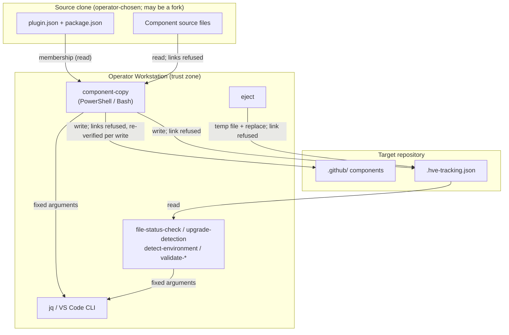

<!-- markdownlint-disable-file -->
# HVE Core Installer Skill Security Model

This document records the STRIDE threat model for the hve-core-installer skill. The skill ships 16 scripts as 8 behaviorally equivalent PowerShell and Bash pairs under `scripts/`: `component-copy`, `collision-detection`, `detect-environment`, `eject`, `file-status-check`, `upgrade-detection`, `validate-extension`, and `validate-installation`. The model is organized by trust bucket: Source clone and plugin manifest (B1), Target repository writes (B2), Tracking manifest and eject (B3), and Caller process and local tools (B4). Each bucket enumerates all six STRIDE categories with the in-code mitigations that address them. Assets and adversaries are enumerated first. Acknowledged enterprise readiness gaps are listed at the end.

The skill guides an operator through installing HVE Core into their own repository. For clone-based methods, the scripts copy selected agents, prompts, instructions, and skills from a local HVE Core clone into the target repository, then record what was installed in `.hve-tracking.json`. The scripts handle no credentials, open no listener, and make no network requests. They run with the caller's privileges against local files and invoke only `jq` (Bash), `git rev-parse` (environment detection), and, for extension validation, the VS Code CLI.

> **See also: repo-wide STRIDE model.** This skill participates in the repository-wide threat model at [`docs/security/security-model.md`](../../../../docs/security/security-model.md) and is registered in its [Skill Security Models](../../../../docs/security/security-model.md#skill-security-models) section.

## Executive Summary

The installer's highest-risk behavior is **writing files into a user's repository from a source clone that may be a fork or a substituted local checkout**. Component copy validates every requested path against the source `plugin.json` membership before the first write.

Links are refused on both sides of a copy:

* on the source side, anywhere between the source root and a component;
* on the target side, anywhere between the target root and a destination;
* at the tracking manifest itself.

Target containment is re-verified immediately before each write, which narrows but does not eliminate the check-to-write race. The upstream-origin check is advisory. The operator remains responsible for trusting the content of the source they install from. Residual risk concentrates in that content trust, the check-to-write race, and platforms where containment has not been exercised by execution.

### Security Posture Overview

| Dimension          | Value                                                                                                                               |
|--------------------|-------------------------------------------------------------------------------------------------------------------------------------|
| Runtime surface    | Local PowerShell and Bash twins; file copy into a target repository; `jq`, `git rev-parse`, and VS Code CLI subprocesses            |
| Trust buckets      | B1 source clone and plugin manifest, B2 target repository writes, B3 tracking manifest and eject, B4 caller process and local tools |
| Credentials        | None handled or persisted                                                                                                           |
| Network egress     | None from the scripts                                                                                                               |
| Open residual gaps | 7 (Spoofing-Med: source content is trusted after an advisory origin check)                                                          |

### Platform Verification

Containment claims in this model were verified by execution on these platforms:

| Platform                                                    | Evidence                                                                                                                  | Result                                                                                                                                         |
|-------------------------------------------------------------|---------------------------------------------------------------------------------------------------------------------------|------------------------------------------------------------------------------------------------------------------------------------------------|
| Windows 11, PowerShell 7.6.6                                | `tests/component-copy.Tests.ps1` and `tests/eject.Tests.ps1` run natively                                                 | Symlink, directory junction, check-to-write, source-link, and manifest-link cases pass. The junction case runs and passes rather than skipping |
| Linux (Ubuntu under WSL), PowerShell 7.5 with Bash and `jq` | The full installer Pester suite, including PowerShell and Bash parity cases. The same suite runs in CI on `ubuntu-latest` | All containment and parity cases pass; the Windows-only junction case skips                                                                    |

Git for Windows ships with `core.symlinks=false`. With that default, a cloned repository materializes committed symlinks as plain text files containing the link target, so a symlink delivered through a cloned fork does not reach the installer as a link. This was observed by cloning a repository containing a symlink entry with Git for Windows 2.55. Real links appear only when symlinks are enabled (`core.symlinks=true`) and the account can create them. Per the [Git for Windows documentation](https://gitforwindows.org/symbolic-links.html), that means an Administrator, Developer Mode, or an explicit privilege grant. This lowers the likelihood of link-based threats on a default Windows install. On Linux and macOS, cloned symlinks materialize by default, and the refusals in B1 and B2 apply.

macOS was not exercised (G-TAM-2). Bash under Git for Windows was not exercised (G-TAM-3).

## Contents

* [System Description](#system-description)
* [Trust Boundaries](#trust-boundaries)
* [Assets](#assets)
* [Adversaries](#adversaries)
* [Bucket B1: Source clone and plugin manifest](#bucket-b1-source-clone-and-plugin-manifest)
* [Bucket B2: Target repository writes](#bucket-b2-target-repository-writes)
* [Bucket B3: Tracking manifest and eject](#bucket-b3-tracking-manifest-and-eject)
* [Bucket B4: Caller process and local tools](#bucket-b4-caller-process-and-local-tools)
* [Enterprise Readiness Gaps](#enterprise-readiness-gaps)
* [References](#references)

## System Description

### Components

1. `scripts/component-copy.ps1` and `scripts/component-copy.sh`: resolve requested components against the source `plugin.json`, validate every path, refuse links on the source and target sides, copy files, and write `.hve-tracking.json`.
2. `scripts/collision-detection.ps1` and `scripts/collision-detection.sh`: run component copy in report-only mode, so the pre-write check resolves components exactly as the copy does. Nothing is written.
3. `scripts/eject.ps1` and `scripts/eject.sh`: mark a tracked component `ejected` in `.hve-tracking.json`, so future upgrades skip it. The files stay on disk.
4. `scripts/file-status-check.ps1` and `scripts/file-status-check.sh`: compare each tracked file's current SHA-256 hash with the recorded hash, and report `managed`, `modified`, `ejected`, or `missing`. Read-only.
5. `scripts/upgrade-detection.ps1` and `scripts/upgrade-detection.sh`: compare the recorded version with the source `package.json` version, and report the recorded selection. Read-only.
6. `scripts/detect-environment.ps1` and `scripts/detect-environment.sh`: report whether the session is local, a dev container, or Codespaces. Read-only.
7. `scripts/validate-installation.ps1` and `scripts/validate-installation.sh`: check that the expected `.github` directories and method-specific configuration exist. Read-only.
8. `scripts/validate-extension.ps1` and `scripts/validate-extension.sh`: query the VS Code CLI for the installed HVE Core extension. Read-only.

### Data Flow



## Trust Boundaries

### Boundary Diagram

```text
┌──────────────────────────────────────┐
│ TRUST BOUNDARY: Source clone         │
│  ┌────────────────────────────────┐  │
│  │ plugin.json, package.json,     │  │
│  │ component source files         │  │
│  └────────────────────────────────┘  │
└──────────────────┬───────────────────┘
                   │ read (membership check, source links refused)
┌──────────────────▼───────────────────────────────────────┐
│ TRUST BOUNDARY: Operator Workstation                     │
│  ┌───────────────┐   ┌──────────┐   ┌──────────────────┐ │
│  │ installer     │   │ jq       │   │ VS Code CLI      │ │
│  │ scripts       │   │          │   │ (allow-listed)   │ │
│  └───────────────┘   └──────────┘   └──────────────────┘ │
└──────────────────┬───────────────────────────────────────┘
                   │ write (target links refused, re-verified per write)
┌──────────────────▼───────────────────┐
│ TRUST BOUNDARY: Target repository    │
│  ┌────────────────────────────────┐  │
│  │ .github/ components            │  │
│  │ .hve-tracking.json             │  │
│  └────────────────────────────────┘  │
└──────────────────────────────────────┘
```

### Boundary Descriptions

| Boundary             | Assets Protected                                 | Controls Enforced                                                                                                               |
|----------------------|--------------------------------------------------|---------------------------------------------------------------------------------------------------------------------------------|
| Source clone         | Integrity of what is installed                   | Advisory upstream-origin check; `plugin.json` membership; `.github/` manifest-path prefix; source-side link refusal; exclusions |
| Operator Workstation | Caller process, local tools                      | Array arguments (no shell); `jq --arg` data binding; VS Code CLI name allow-list with fixed arguments                           |
| Target repository    | Files outside the target root; tracking manifest | Path validation; target ancestor link refusal re-verified per write; manifest link refusal; schema gate before any write        |

## Assets

| Id | Asset                                 | Lifetime                | Notes                                                                                      |
|----|---------------------------------------|-------------------------|--------------------------------------------------------------------------------------------|
| A1 | Files outside the target root         | Persistent              | Must never be written by the installer                                                     |
| A2 | Files outside the source clone        | Persistent              | Must never be read into the target repository                                              |
| A3 | Installed components in the target    | Persisted               | Agents, prompts, instructions, and skills later loaded by Copilot in the user's repository |
| A4 | `.hve-tracking.json`                  | Persisted               | Records source, version, selection, and per-file SHA-256 hash and status                   |
| A5 | Source clone content                  | Operator-managed        | Chosen by the operator; may be upstream, a fork, or a local development checkout           |
| A6 | `jq`, `git`, and VS Code CLI binaries | External, PATH-resolved | Unpinned host dependencies (G-SUP-1)                                                       |

## Adversaries

| Id    | Adversary                                              | In-scope mitigations                                                                                                                                                    |
|-------|--------------------------------------------------------|-------------------------------------------------------------------------------------------------------------------------------------------------------------------------|
| ADV-a | Author of a malicious fork or substituted source clone | Advisory origin check with explicit confirmation; membership in the source `plugin.json`; source-side link refusal. Content of declared components is trusted (G-SPF-1) |
| ADV-b | Author of a target repository containing planted links | Target ancestor link refusal re-verified immediately before each write; manifest link refusal; refusal before any write                                                 |
| ADV-c | Local process racing the check and the write           | Per-write re-verification narrows the window; the check and the write are not atomic (G-TAM-1)                                                                          |
| ADV-d | Caller or agent supplying adversarial component paths  | Rejects control characters, backslashes, absolute paths, drive letters, empty segments, `.` and `..`, unknown fields, non-members, and duplicate targets                |
| ADV-e | Anyone who can edit files in the target repository     | SHA-256 status detects local modification of tracked files, but the manifest is not integrity-protected (G-TAM-4)                                                       |

## Bucket B1: Source clone and plugin manifest

### Spoofing

* For the mounted and multi-root methods, installation guidance runs `git -C <HveCoreBasePath> remote get-url origin` before any write. When `origin` is missing or does not match an expected `github.com/microsoft/hve-core` HTTPS, SCP-like SSH, or `ssh://` form, it warns and requires an explicit `yes` to continue. This is an advisory trust signal, not proof of repository integrity. Intentional forks and local development clones are allowed after confirmation (G-SPF-1).

### Tampering

* Only components declared in the source `plugin.json` can be installed. Every `plugin.json` path must start with `.github/`, and every requested component must match a declared member after package-path projection.
* A component is refused before any write when its source path, or any ancestor between the source root and the component, is a link. `Assert-SourceWithoutLink` in PowerShell checks the `ReparsePoint` attribute, which also covers Windows junctions; `assert_source_without_link` in Bash tests `-L`. Inside a skill directory, file links are omitted and directory links are not traversed.
* Local environment, cache, and test paths are never copied: `tests`, `.venv`, `.hypothesis`, `node_modules`, `__pycache__`, `.ruff_cache`, `.pytest_cache`, `.git`, `.env` and its variants, `.DS_Store`, `Thumbs.db`, and `*.pyc`.
* The content of declared components is copied as-is. The installer does not verify signatures or compare content with upstream (G-SPF-1).

### Repudiation

* Not applicable. This is a local, operator-driven installer with no audit requirement. The tracking manifest records the source identifier, version, selection, and install timestamp for the operator's own reference.

### Information Disclosure

* Source-side link refusal prevents a link in the source clone from pulling files outside the clone (for example, from the operator's home directory) into the target repository, where they could later be committed.
* No credentials are read and no network requests are made.

### Denial of Service

* A malformed `plugin.json`, a manifest that declares no installable components, or a missing source file fails preflight with an error before any write.

### Elevation of Privilege

* The scripts run with the caller's privileges; there is no privilege transition. Installed components are Copilot customization files that take effect only when the user's tools load them.

### Risk Rating

| Threat                                                     | Likelihood | Impact | Residual Risk | Status                          |
|------------------------------------------------------------|------------|--------|---------------|---------------------------------|
| Malicious content from a fork installed after confirmation | Low        | High   | Med           | Accepted (G-SPF-1)              |
| Source link pulls outside files into the target repository | Low        | High   | Low           | Mitigated (source link refusal) |
| Undeclared or excluded path installed                      | Low        | Med    | Low           | Mitigated                       |

## Bucket B2: Target repository writes

### Spoofing

* Not applicable. The target is the operator-supplied directory; the installer asserts no identity over it.

### Tampering

* Containment is decided by real filesystem state, not by the shape of a joined string. The full destination must lie under the separator-terminated target root. Every existing ancestor from the target root to the destination is inspected, and the component is refused when any of them is a link: `Assert-WithinTargetRoot` checks `ReparsePoint`, covering symlinks and Windows junctions; `assert_within_target_root` tests `-L`.
* The Bash implementation deliberately walks ancestors instead of resolving the path with `realpath -m`, which is a GNU coreutils extension and is not dependable on macOS. The leaf does not exist yet on a first install.
* Containment runs in preflight, then again immediately before each file is written. The re-check narrows the window in which a link planted between the two checks could redirect a write. It does not make the check and the write atomic (G-TAM-1).
* The PowerShell and Bash implementations are kept behaviorally equivalent. Parity tests assert the same accept and refuse verdicts for clean, symlinked-destination, linked-source, and linked-manifest cases.

### Repudiation

* Not applicable. Local operator action; per-component copy results are printed to the caller.

### Information Disclosure

* Not applicable. The installer writes only files taken from the source clone into the target repository, and reports target-relative paths.

### Denial of Service

* Collision detection reports existing components before any write. Installation guidance requires explicit confirmation and a per-collision choice to overwrite or keep. Ejected files are never overwritten.

### Elevation of Privilege

* A write outside the target root, for example into a user profile or a global configuration location, is refused by the containment check above. The caller's privileges bound what an escaped write could reach.

### Risk Rating

| Threat                                                    | Likelihood | Impact | Residual Risk | Status                            |
|-----------------------------------------------------------|------------|--------|---------------|-----------------------------------|
| Planted destination link redirects a write outside target | Low        | High   | Low           | Mitigated (ancestor link refusal) |
| Link planted between the check and the write              | Low        | High   | Low           | Partially Mitigated (G-TAM-1)     |
| Containment divergence between PowerShell and Bash        | Low        | High   | Low           | Mitigated (parity tests)          |

## Bucket B3: Tracking manifest and eject

### Spoofing

* Not applicable. The manifest records a `source` string and version for operator reference; nothing authenticates against them.

### Tampering

* `component-copy` and `eject` refuse a `.hve-tracking.json` that is a link, before reading or writing it and before any component copy. The PowerShell scripts inspect the link itself rather than relying on `Test-Path`, and the Bash scripts test `-L`, so a dangling link is refused as well. The manifest write therefore cannot be redirected outside the target root.
* An existing manifest must be schema version 2. Any other version fails before the target is touched, with clean-reinstall guidance.
* `eject` writes the updated manifest to a new, randomly named temporary file in the same directory (a GUID name in PowerShell, `mktemp` in Bash), replaces the manifest with it, and removes the temporary file if the write fails. A link planted at a predictable temporary name therefore cannot redirect the write. `component-copy` rewrites the manifest in place at the end of a run (G-DOS-1).
* Each tracked file carries a SHA-256 hash and a `managed` or `ejected` status. `file-status-check` reports `modified` when a file's hash differs. This detects local modification of tracked files. It is not integrity protection: anyone who can edit the files can edit the manifest, which is neither signed nor otherwise protected (G-TAM-4).

### Repudiation

* Not applicable. The manifest records installation and ejection timestamps as operator information, not as tamper-evident audit records.

### Information Disclosure

* `file-status-check` hashes files at the paths recorded in the manifest and reports only a status per path. It does not print file content.

### Denial of Service

* A truncated or malformed manifest fails parsing before any write. Recovery is to delete the manifest and reinstall, which discards recorded ejections (G-DOS-1).

### Elevation of Privilege

* Not applicable. Ejection changes only the manifest status of the named component's files.

### Risk Rating

| Threat                                         | Likelihood | Impact | Residual Risk | Status                            |
|------------------------------------------------|------------|--------|---------------|-----------------------------------|
| Linked manifest redirects the manifest write   | Low        | Med    | Low           | Mitigated (manifest link refusal) |
| Manifest edited to hide local modification     | Low        | Low    | Low           | Accepted (G-TAM-4)                |
| Interrupted copy leaves an unreadable manifest | Low        | Low    | Low           | Accepted (G-DOS-1)                |

## Bucket B4: Caller process and local tools

### Spoofing

* `jq`, `git`, and the VS Code CLI (`code` or `code-insiders`) are resolved by name from `PATH`. The installer trusts the operator's environment for binary identity (G-SUP-1).

### Tampering

* The VS Code CLI name is restricted to `code` or `code-insiders`: `[ValidateSet]` in PowerShell, with the same allow-list in Bash, checked before execution. It is invoked only with the fixed `--list-extensions` and `--show-versions` arguments.
* The Bash scripts pass manifest paths and values to `jq` through `--arg` and `--argjson`, not by building the `jq` program from input. Every script is invoked with discrete arguments, not a composed shell string.

### Repudiation

* Not applicable. Local, interactive tooling.

### Information Disclosure

* `detect-environment` reports only environment type flags (`CODESPACES`, `REMOTE_CONTAINERS`, `/.dockerenv`, devcontainer and workspace file presence, and whether the repository is named `hve-core`). It prints no environment values or credentials.

### Denial of Service

* Not applicable. The read-only scripts perform bounded local checks.

### Elevation of Privilege

* Subprocesses run with the caller's privileges and no shell. There is no privilege transition.

### Risk Rating

| Threat                                     | Likelihood | Impact | Residual Risk | Status                          |
|--------------------------------------------|------------|--------|---------------|---------------------------------|
| Arbitrary command via the VS Code CLI name | Low        | High   | Low           | Mitigated (allow-list)          |
| PATH-resolved tool substitution            | Low        | High   | Low           | Accepted (operator environment) |

## Enterprise Readiness Gaps

The following are known limitations recorded so operators can make informed deployment decisions. Severity ratings are the project's own assessment and are not equivalent to a CVSS score.

| Id      | Gap                                                                                                                                                                                                                                           | Severity        | Status                                                                               |
|---------|-----------------------------------------------------------------------------------------------------------------------------------------------------------------------------------------------------------------------------------------------|-----------------|--------------------------------------------------------------------------------------|
| G-SPF-1 | The upstream-origin check is advisory. A fork or substituted local clone is accepted after explicit confirmation, and the content of its declared components is installed without signature or content verification.                          | Spoofing-Med    | Accepted; install from a trusted source and review components before committing them |
| G-TAM-1 | Target containment is re-verified immediately before each write, which narrows but does not eliminate the check-to-write race. A local process able to swap a directory for a link in that window could still redirect a write.               | Tampering-Low   | Accepted; the window requires concurrent local write access to the target            |
| G-TAM-2 | Containment has not been exercised on macOS. The Bash implementation avoids the GNU-only `realpath -m` and uses a POSIX-portable ancestor `-L` walk, so no known GNU-specific dependency exists. That is a design argument, not verification. | Tampering-Low   | Open; verify by running the installer Pester suite on macOS                          |
| G-TAM-3 | Windows containment, including the directory-junction case, was verified on a developer machine only. CI runs on `ubuntu-latest`, where the junction case skips permanently. Bash under Git for Windows was not exercised.                    | Tampering-Low   | Open; add a Windows CI job for the installer Pester suite                            |
| G-TAM-4 | `.hve-tracking.json` is not integrity-protected. SHA-256 status detects local modification of tracked files, but anyone who can edit those files can also edit the manifest.                                                                  | Tampering-Low   | Accepted; the manifest is operator bookkeeping, not a security control               |
| G-DOS-1 | `component-copy` rewrites `.hve-tracking.json` in place. An interrupted run can leave a manifest that later runs reject, and recovery by reinstall discards recorded ejections. `eject` uses a temporary file and replace.                    | DoS-Low         | Accepted                                                                             |
| G-SUP-1 | `jq`, `git`, and the VS Code CLI are external, unpinned dependencies resolved from `PATH`.                                                                                                                                                    | SupplyChain-Low | Accepted (operator keeps local tools trusted)                                        |

For an active issue tracker entry covering these gaps, see the [hve-core issues list](https://github.com/microsoft/hve-core/issues).

## References

* [STRIDE Threat Model](https://learn.microsoft.com/azure/security/develop/threat-modeling-tool-threats)
* [CWE-59: Improper Link Resolution Before File Access](https://cwe.mitre.org/data/definitions/59.html)
* [CWE-367: Time-of-check Time-of-use Race Condition](https://cwe.mitre.org/data/definitions/367.html)
* [Git for Windows: symbolic links](https://gitforwindows.org/symbolic-links.html)
* [Repository security model](../../../../docs/security/security-model.md)

🤖 Crafted with precision by ✨Copilot following brilliant human instruction, then carefully refined by our team of discerning human reviewers.
